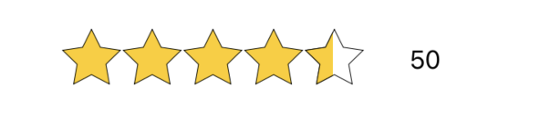
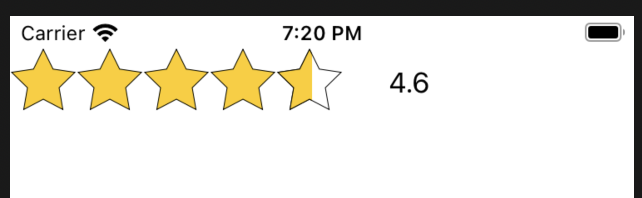
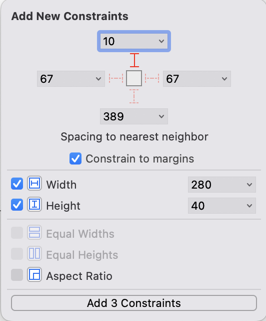
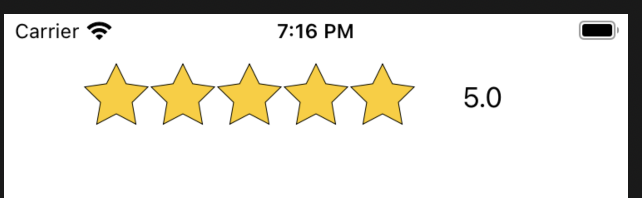

# ⭐️ LiteStarView

## Desciption

A light weight ⭐️ star rating UI component for iOS written in Swift.

# 🏗 Installation 

### Manually 

You can download or copy the following files. 

- StarView.swift
- StarGestures.swift
- StarBezier.swift

### CocoaPods

Currently not on CocoaPods 

# 📋 Setup

### 1. Create and drop a UIView then set the class to StarView.

### 2. Set your constraints

There are many way to layout this view but a height constraint is needed for the stars to be drawn correctly. Take a look at the examples below

 This is the formula to help calculate the width.
`(height * amountOfStars) + (height * 2)`

 **Examples**
 

---

**Note:** *Also need to set Center Horizontal in Safe Area to the parent.*

**Formula Example:**  `(40 * 5) + (40 * 2) = 280`

### 3. The view can be set up in one of two ways.

**- Show rating (Non-interactive)**

**- User provided rating (interactive)**

# 📐 Design

The design is minimalist, with a few customizations. 

**Note**: *This view is not currently IBDesignable*

### Features 

- Can be used to show ratings followed by number of ratings.
- If `isUserInteractionEnabled` user can provied a rating by panning or tapping on stars, rating will be shown.
- Gives haptic Feedback when user selects/deselect one full star
- Round stars to the nears whole 

### Modifiers / Customization

- `starCount` :`Int`              : Number of stars in view  
- `ratingCount`:`Int`           : Amount of ratings for item
- `rating`: `CGFloat`            : Rating for item
- `roundRating`:`Bool`         : Will use whole numbers
- `fillColor` :`UIColor`      : Star fill color
- `stokeColor` :`UIColor`    : Star outline color 

# 🎲 Behavior

### Updating the view

Stars are automaticity update when when the `rating` or `ratingCount` changes. 
Also calling `starView.updateStar()` will force a update. So make your changes before calling!

