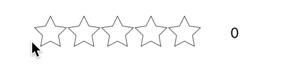

# ⭐️ LiteStarView

## Desciption

A light weight star ⭐️ rating UI component for iOS written in Swift.

## Installation 

### Manually 

You can download or copy the following files 

- StarView.swift
- StarGestures.swift
- StarBezier.swift

### CocoaPods

Currently not on CocoaPods 

## Setup

1. Create and drop a UIView then set the class to StarView.

2. Set your constraints

The view can be set up in one of two ways.

- Show Rating (Non-interactive)

- User provide rating (interactive)

## Design

The design is minimalist, with a few customizations. 

**Note**: *This view is not currently IBDesignable*

### Features 

- Can be used to show ratings followed by number of ratings.
- If `isUserInteractionEnabled` user can provied a rating by panning or tapping on stars, rating will be shown.
- Gives haptic Feedback when user selects/deselect one full star
- Round stars to the nears whole 

### Modifiers / Customization

- `starCount` :`Int`              : Number of stars in view  
- `ratingCount`:`Int`           : Amount of ratings for item
- `rating`: `CGFloat`            : Rating for item
- `roundRating`:`Bool`         : Keeps rating in whole numbers
- `fillColor` :`UIColor`      : Star fill color
- `stokeColor` :`UIColor`    : Star outline (strokeColor) color 

## Behavior

### Updating the view

Stars are automaticity update when when the `rating` or `ratingCount` changes. 
Also calling `starView.updateStar()` will force a update. So make your changes before calling!

